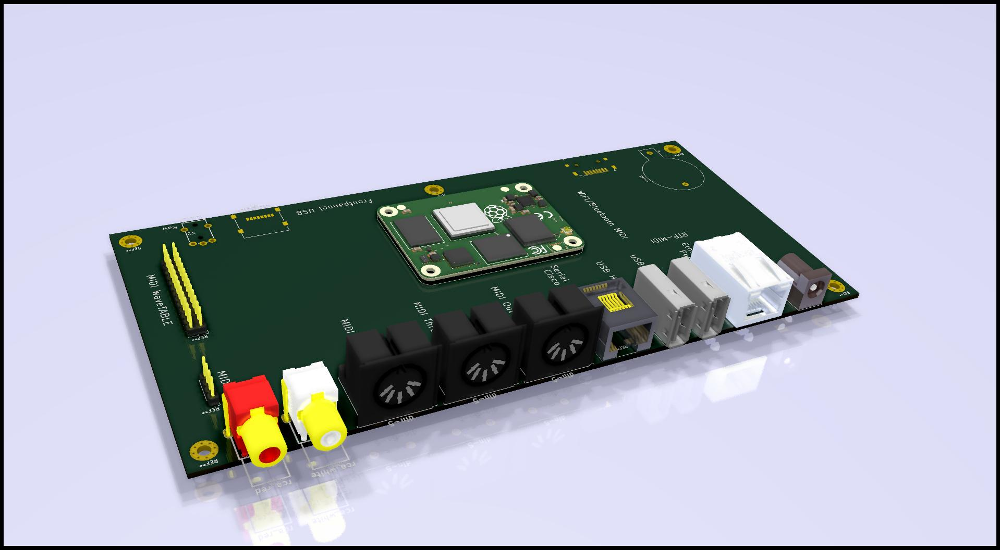

# rtpMidi
Concept design to be a 1/2 Rack based raspberry pi driven MIDI rack unit like MT32/SC55

Work in progress, concept at this stage

## Desired Fetures

MIDI Features
* MIDI in/out/thru via DIN5 connectors
* MIDI ttl 
* MIDI Host via USB (ie; for keyboards)
* MIDI rtp via networl/wireless/bluetooth
* MIDI wavetable header

* Serial console via cisco pinout RJ45

* Power PoE
* Power 2.1mm barrel jack

* Audio out via RCA
* Audio mixer chip of some sort